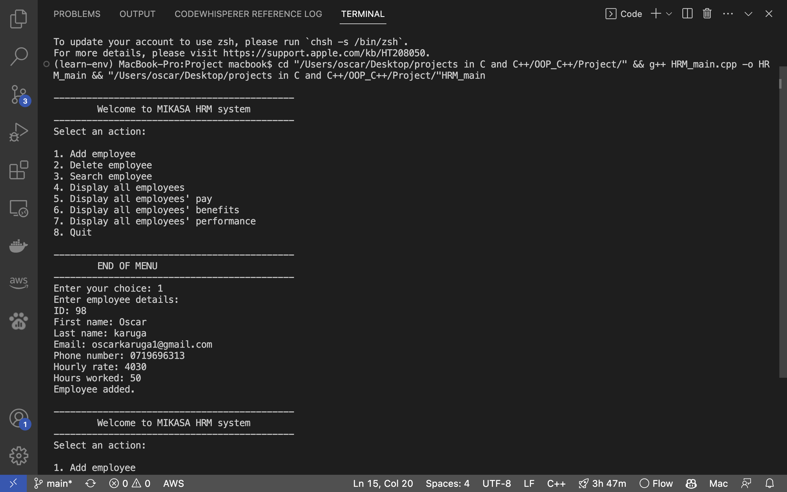
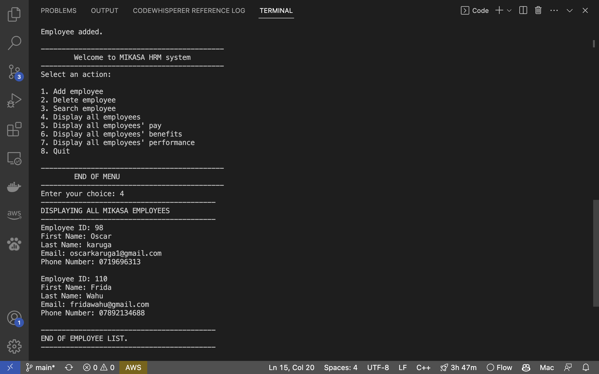
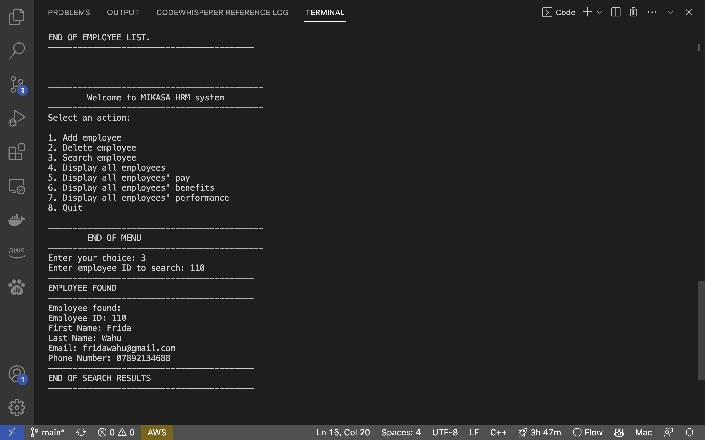
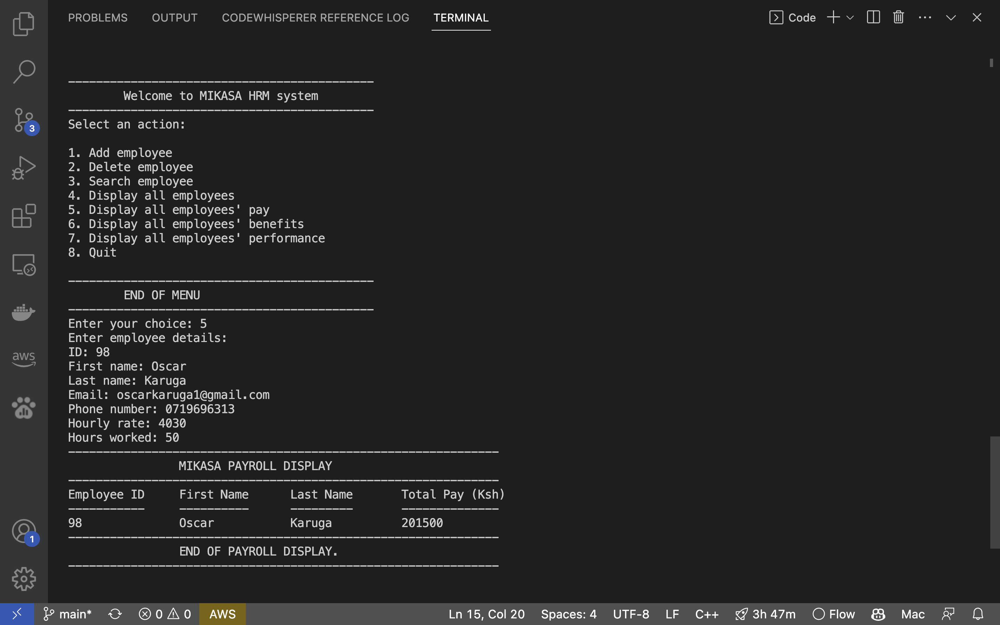
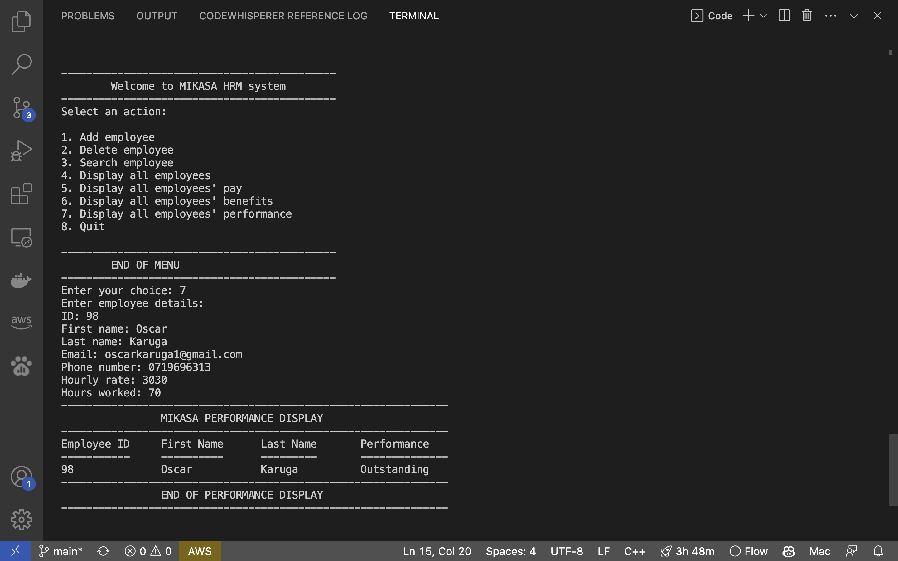

# MIKASA Human_Resource_Management_System

This is a C++ project that simulates an employee management system. 
The classes for handling the various functions have been grouped into a single header file which is then called when the main program of the project is being executed.

## Features
## Classes

### 1.Employee Class
This is the parent class that handles creation of employees, adding employees, deleting employees, displaying all the employees in the system, and searching for a given employee given their unique id. 
The employees are implemented through a linked list.

### 2.Payroll Class
The Payroll class is a child class of Employee and is responsible for calculating the pay of a given employee based on their hours worked and rate. 
It includes the ability to display all employees' total pay.

### 3. Benefits Class
The Benefits class is also a child class of Employee and inherits its member functions. 
It determines if an employee qualifies for a benefit package for a particular week. If an employee exceeds the company's target hours per week, which is 40 hours, they receive what they would get for a normal working hour added to their base pay.

### 4.Performance Class
The Performance class is a child of Employee class and is used to assess how an employee is performing at a particular week. 
The metric is the number of hours the employee has clocked in. Above 60 hours, they are Outstanding, above or equal to 40 hours, they are Above Average, at 40 hours, they are Average, and below 40 hours, they are Performing Poorly.

### 5.Attendance Class
The Attendance class handles the attendance of employees.

## Implementation
The classes for handling these functions have been grouped into a single header file that is called when the main program of the project is being executed.

## Screenshots
Here are some sample Screenshots of the project working:

### 1.Adding_Employee
 
### 2.Displaying Employee(s)
 
### Searching and displaying an Employee
 
### 3.Payroll for Employee(s)
 
### 4.Benefit for Employee(s)
 
### 5.Performance for Employee(s)
 

## Usage
To use this project, simply run the main program in your C++ compiler. 
Make sure you have the file HRM.h in the same folder as HRM_main as it is being included as a header file in the main program 
then run the HRM_main program
You can then follow the prompts to add, delete, search, display, and manage your employees.

## Credits
This project was created by OSCAR KARUGA. 
If you have any questions or suggestions, please feel free to contact me.

## Contributing
Contributions are welcome! Please open an issue or pull request.

## License
This project is licensed under the MIT License - see the [LICENSE.md](LICENSE.md) file for details.
